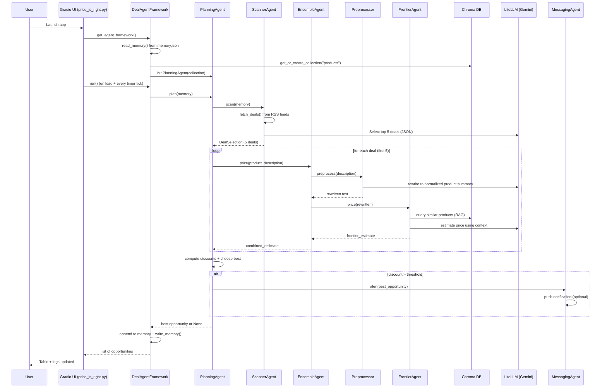

# Price Agent Architecture — “The Price is Right”

## Overview
This project is a **multi-agent deal discovery + price estimation system** with a **Gradio UI**. It continuously:

1. **Scrapes deals** from RSS feeds.
2. **Selects the best deals** using an LLM (Scanner Agent).
3. **Estimates “true price”** using an ensemble of pricing strategies (Ensemble Agent).
4. **Computes discount** and decides whether to alert (Planning Agent).
5. **Persists memory** of past surfaced deals (`memory.json`).
6. **Displays results and logs** in a live UI (`price_is_right.py`).

The system is designed so that each “Agent” owns one responsibility and the **Planning Agent** orchestrates the workflow.

---

## High-level component diagram

```mermaid
flowchart LR
  UI[Gradio UI\nprice_is_right.py] -->|calls| AF[DealAgentFramework\ndeal_agent_framework.py]
  AF -->|creates| PL[PlanningAgent\nagents/planning_agent.py]

  PL --> SC[ScannerAgent\nagents/scanner_agent.py]
  PL --> EN[EnsembleAgent\nagents/ensemble_agent.py]
  PL --> MS[MessagingAgent\nagents/messaging_agent.py]

  SC --> RSS[RSS Feeds\n(dealnews.com)]
  EN --> PR[Preprocessor\nagents/preprocessor.py]

  EN --> FA[FrontierAgent\nagents/frontier_agent.py]
  EN --> SA[SpecialistAgent\nagents/specialist_agent.py]
  EN --> NA[NeuralNetworkAgent\nagents/neural_network_agent.py]

  FA --> VDB[(Chroma Vector DB\nproducts_vectorstore)]
  FA --> LLM[LLM Provider\nLiteLLM -> Gemini]
  SC --> LLM
  PR --> LLM
  MS --> LLM

  MS --> PUSH[Pushover API\n(optional)]

  AF --> MEM[memory.json\n(persisted state)]
  AF --> VDB
```

---

## Runtime sequence (what happens at each stage)



---

## Key files and what they do

## Entry point
- `price_is_right.py`
  - Builds the Gradio UI.
  - Streams logs to the UI using a queue handler.
  - Runs the pipeline in a background thread.
  - Refreshes periodically with a `gr.Timer`.

## Orchestration / state
- `deal_agent_framework.py`
  - Owns the persistent “memory” of surfaced opportunities (`memory.json`).
  - Owns the Chroma collection (`products_vectorstore`, collection name `products`).
  - Creates and runs the `PlanningAgent`.
  - Provides `get_plot_data()` for the UI vector visualization.

- `memory.json`
  - The persisted list of `Opportunity` objects previously surfaced.
  - Used to avoid re-alerting on the same URLs.

## Core workflow agents
- `agents/planning_agent.py`
  - The top-level orchestrator.
  - Steps:
    1. `ScannerAgent.scan()` to pick deals.
    2. `EnsembleAgent.price()` to estimate.
    3. compute discount and optionally `MessagingAgent.alert()`.

- `agents/scanner_agent.py`
  - Collects candidate deals from RSS feeds.
  - Uses an LLM (via LiteLLM) to pick/normalize the “best 5” deals.
  - Output contract: **JSON** matching `DealSelection`.

- `agents/ensemble_agent.py`
  - Calls multiple pricing strategies and combines them.
  - Uses `Preprocessor` to normalize descriptions.

## Pricing strategies
- `agents/frontier_agent.py`
  - RAG-style pricing:
    - embed the item,
    - retrieve similar products + known prices from Chroma,
    - ask an LLM to estimate price.

- `agents/specialist_agent.py`
  - Remote fine-tuned model on Modal (optional).
  - In this repo, it is **disabled by default** unless `MODAL_ENABLED=1`.

- `agents/neural_network_agent.py`
  - Local inference using a deep neural network weight file `deep_neural_network.pth`.
  - If the weights are missing, it disables itself and returns `0.0`.

## Notification
- `agents/messaging_agent.py`
  - Optional push notification via Pushover.
  - Can also craft message text via an LLM (via LiteLLM if configured).

## Deal scraping + data models
- `agents/deals.py`
  - RSS + HTML scraping.
  - Defines Pydantic models:
    - `Deal`, `DealSelection`, `Opportunity`.

---

## Data contracts (important invariants)

## `Deal`
- `product_description`: short paragraph describing the product itself
- `price`: numeric price of the deal
- `url`: canonical link

## `Opportunity`
- `deal`: `Deal`
- `estimate`: estimated true price
- `discount`: `estimate - deal.price`

---

## External dependencies and where they are used

- **RSS / Web scraping**
  - `feedparser`, `requests`, `beautifulsoup4`
  - used in `agents/deals.py`

- **Vector database (RAG)**
  - `chromadb`
  - used in `deal_agent_framework.py` and `agents/frontier_agent.py`

- **Embeddings**
  - `sentence_transformers`
  - used in `agents/frontier_agent.py`

- **LLM calls (Gemini via LiteLLM)**
  - `litellm`
  - used in `scanner_agent.py`, `frontier_agent.py`, `preprocessor.py`, `messaging_agent.py`

- **UI**
  - `gradio`, `plotly`
  - used in `price_is_right.py`

---

## Configuration (environment variables)

## Required to use Gemini via LiteLLM
- `GEMINI_API_KEY`

## Optional
- `MODAL_ENABLED=1` to enable Modal calls for `SpecialistAgent`
- `PUSHOVER_USER`, `PUSHOVER_TOKEN` to enable push notifications
- `PRICER_PREPROCESSOR_MODEL` to choose preprocessing model route (if you want to override)

---

## Operational notes

- The app runs continuously (timer tick). If you want a single-shot run, you can comment out the `gr.Timer` tick or run `DealAgentFramework().run()` directly.
- If the Chroma DB (`products_vectorstore`) is empty/missing, the app still runs; the plot is empty and RAG context is minimal.
- The project is designed to degrade gracefully:
  - missing API keys -> scanner returns test deals
  - missing Modal -> specialist returns `0.0`
  - missing NN weights -> NN returns `0.0`

---

## Minimal “happy path” without optional services

Even without Modal, a populated Chroma DB, or NN weights, the system still demonstrates:

- end-to-end agent orchestration
- UI + logging
- deal scraping + memory
- LLM-based selection and LLM-based pricing via Gemini (LiteLLM)
